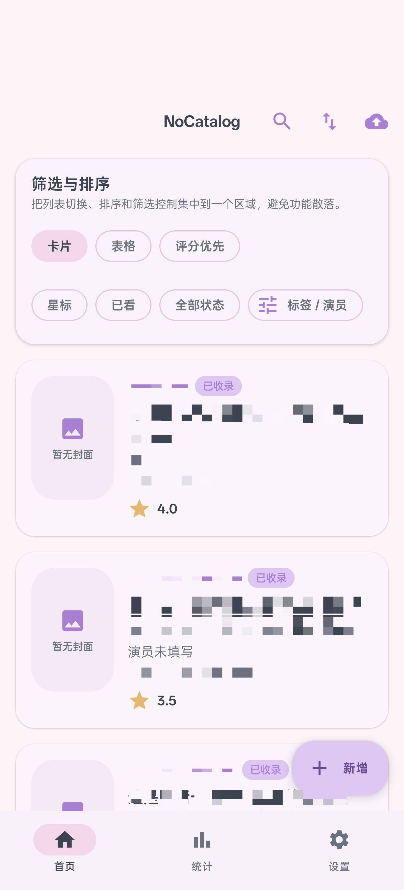
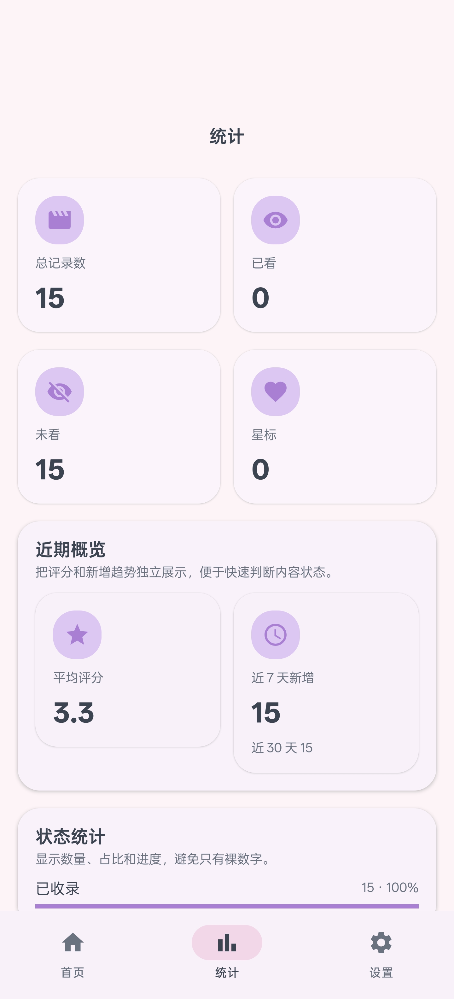
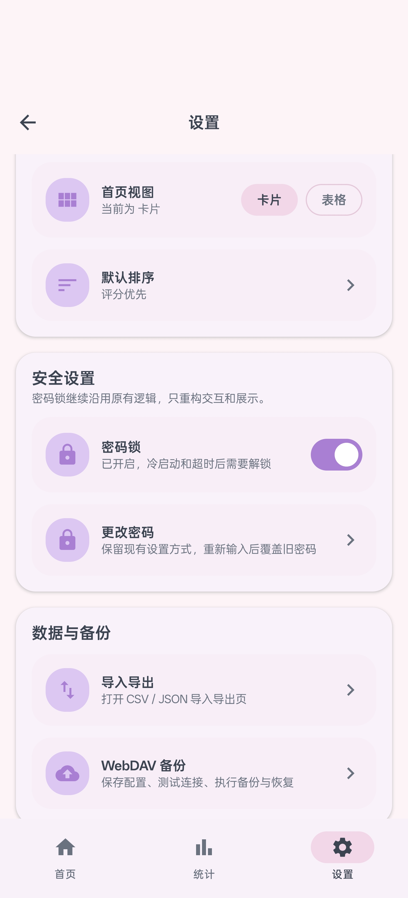

# NoCatalog

NoCatalog 是一个面向 Android 的本地收藏记录应用，主要用于记录影片条目、管理个人收藏状态，并提供导入导出、备份恢复、密码锁和统计分析能力。项目全程以 UTF-8 编码维护，强调本地优先、结构清晰和可持续扩展。

## 应用用途

这个应用的核心目标是把“零散的影片记录”整理成一套可检索、可编辑、可备份的个人目录系统。当前版本已经支持：

- 本地条目管理：新增、编辑、查看详情、更新、删除
- 收藏信息维护：番号、标题、演员、标签、评分、备注、发布日期、来源链接
- 状态管理：想看、已收录、已看、归档
- 首页管理能力：搜索、排序、卡片/表格视图切换、状态/星标/已看筛选、标签与演员高级筛选
- 封面能力：本地封面导入、压缩存储、缩略图展示、远程 URL 兼容
- 统计能力：总数、已看、未看、星标、平均评分、状态统计、Top 标签、Top 演员、近期新增
- 数据流转：CSV 导入导出、JSON 导入导出、导入预览与冲突确认
- 备份能力：WebDAV 配置、测试连接、立即备份、远端列表、恢复导入
- 安全能力：密码锁、冷启动解锁、后台超时重新锁定

## 界面展示

以下截图来自当前版本的真机界面：

### 首页

### 统计页

### 设置页

## 技术方案

本项目采用现代 Android 分层方案实现，当前主要技术栈如下：

- Kotlin
- Jetpack Compose
- Material Design 3
- Hilt
- Room
- DataStore
- Navigation Compose
- Kotlin Coroutines / Flow
- Kotlin Serialization
- OkHttp
- Coil

代码结构按 `core / data / domain / presentation / di` 分层组织，尽量把业务逻辑、数据访问、页面状态和依赖注入解耦，便于后续继续扩展。

## 已完成的工作

围绕这套应用，我已经完成了以下主要工程工作：

- 从空白工程初始化 Android 项目骨架，打通 Gradle、Compose、Hilt、Room、DataStore 和 Navigation 的构建链路
- 建立本地数据闭环，完成实体、DAO、Repository、UseCase 和 ViewModel 的基础实现
- 落地首页、编辑页、详情页、锁屏页、导入预览页、备份页、设置页和统计页
- 实现 CSV / JSON 导入导出与导入预览流程
- 实现 WebDAV 手动备份和远端恢复
- 实现密码锁、会话锁定和超时重新解锁
- 增加封面导入、压缩、缩略图字段与数据库迁移
- 增加标签 / 演员高级筛选和统计模块
- 基于 `ui-suggest.md` 完成整套 UI 重构：
  - 重建 Material 3 Theme、ColorScheme、Typography
  - 统一顶栏、分组卡片、封面占位、统计卡片、设置分组组件
  - 重构首页、统计页、设置页，并统一编辑页和详情页的视觉层级
- 替换 Android 启动图标：
  - 使用 adaptive icon
  - 前景使用项目内 PNG
  - 增加浅色背景层
  - 生成并接入各密度 `mipmap-*` 资源
- 调整首页、统计页、设置页顶部留白，减少重复间距叠加

## 项目特点

- 本地优先：基础使用不依赖在线服务
- 数据可迁移：支持 CSV / JSON 导入导出
- 可恢复：支持 WebDAV 备份恢复
- 可保护：支持密码锁和超时重新锁定
- 可扩展：当前结构已经为后续测试、联调和功能细化预留空间

## 后续计划

接下来主要聚焦于质量和体验收尾，而不是重做架构：

- 增加单元测试、集成测试和 Compose UI 测试
- 做真机与真实 WebDAV 服务端的端到端回归验证
- 继续优化导入冲突处理与异常提示
- 清理当前 KAPT 配置相关警告

## 说明

本仓库中的实现、日志和文档均按 UTF-8 编码维护。若继续迭代，本 README 也应随功能状态同步更新。
